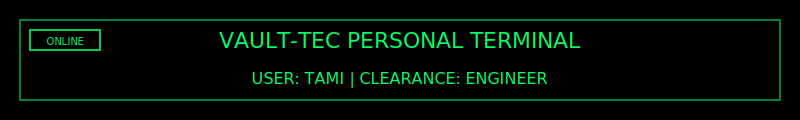
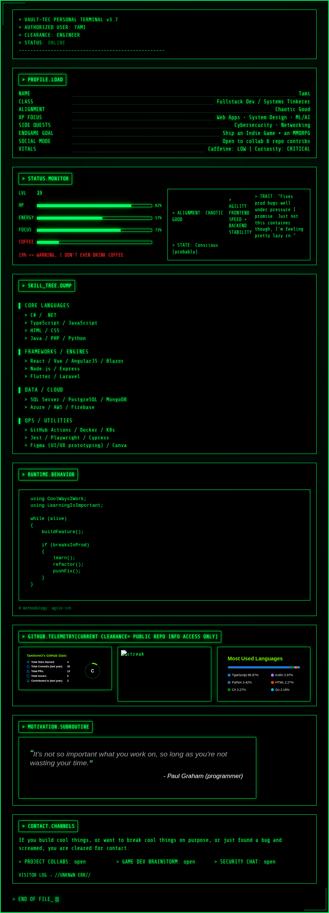

 

  ↓ REQUESTING INTERACTIVE CONTROL. CLICK TO CONTINUE ↓

  

  

<a href="https://tamiloreo.github.io/TamiloreO/" target="_blank"
   style="text-decoration:none;
          color:#00ff66;
          font-family:'Share Tech Mono', monospace;
          font-size:14px;
          display:inline-block;
          background:rgba(0,255,102,0.07);
          padding:6px 10px;
          border:1px solid #00ff66;
          box-shadow:0 0 10px rgba(0,255,102,0.6),
                     0 0 40px rgba(0,255,102,0.2);">
  ▶ ENTER INTERACTIVE TERMINAL MODE
</a>

  

  STATUS: ONLINE • TELEMETRY LINKED • COFFEE SUPPLY CRITICAL

